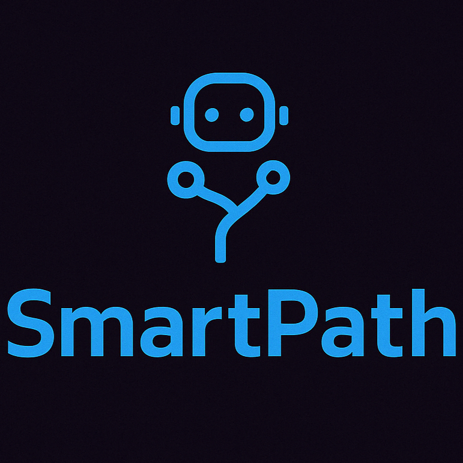
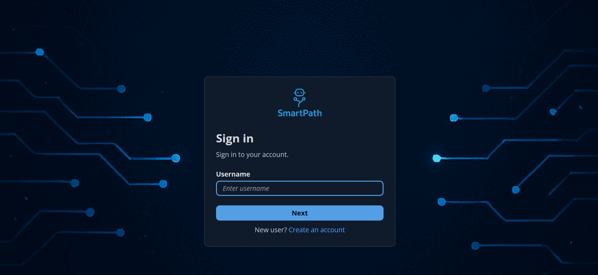
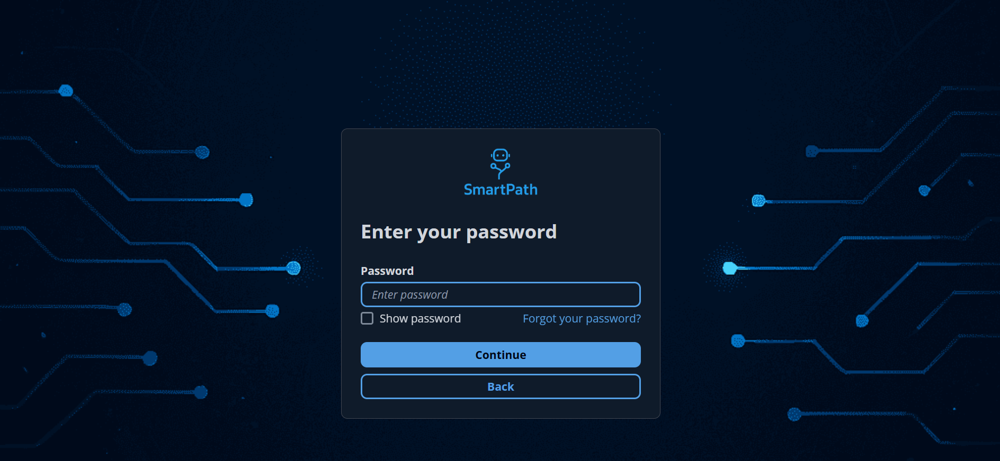
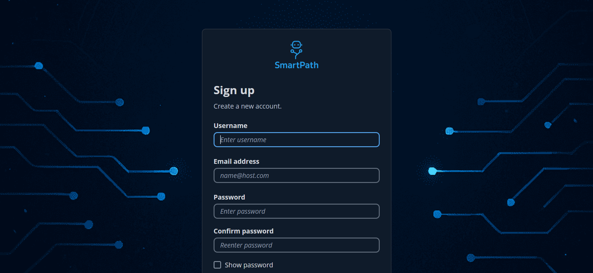
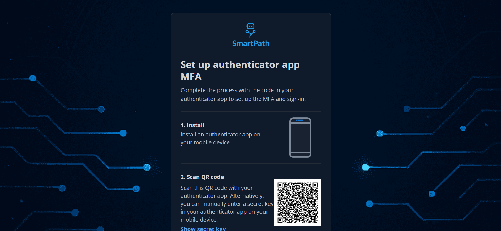
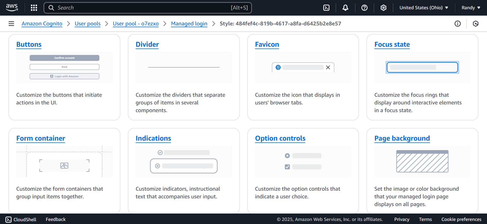

# System name - SmartPath

Members - Alexander Brenes, Franco Rojas, Jeremmy Aguilar and Randy Baeza Ramírez

## Description:
SmartPath is an innovative AI-driven assistant that revolutionizes employee training and real-time assistance by capturing, replicating, and guiding users through complex workflows in any application. By recording voice commands and on-screen actions, SmartPath builds a dynamic knowledge base, enabling real-time, step-by-step assistance, whether adding a bank account, canceling a subscription, or navigating enterprise software like SAP.

**Key Strengths:**

- **Voice and Action-Based Recording:** Users can easily capture workflows using voice commands and on-screen actions.

- **AI-Powered Knowledge Base:** Converts recordings into step-by-step guides that the system can learn, replicate, and explain.

- **Real-Time Assistance:** Detects when a user needs help and offers instant, contextual guidance within the app they're using.

- **Cross-Platform Compatibility:** Works on Windows, macOS, iOS, Android, and major browsers (Chrome, Firefox, Safari). Integrates with 3rd-party apps (banks, ERPs, Netflix, SAP, etc.).

## Stack: write down the final stack to be use decided for the group

## Frontend design specifications

### Authentication platform - Amazon Cognito

We chose **Amazon Cognito** as our authentication platform because it seamlessly integrates with our existing AWS infrastructure while meeting all our requirements. Amazon Cognito is compatible with our frontend in React and ensures quick implementation, including pre-built and customizable login screens. The platform fully covers our needs: email/password authentication, API access for backend integration, multi-factor authentication (MFA), and a sandbox environment for testing.

We've implemented the following login screens using Amazon Cognito to demonstrate the potential UI for our final application.

**Login screen to enter username**

**Login screen to enter password**

**Sign up screen**

**MFA screen**

 

The login screens were fully customized via AWS Console, using Cognito's built-in UI customization options like those shown in the following image.

### Client architecture

**N-Layer architecture**

We're going to use the N-LAYER architecture, dividing the project into layers.

📂src/
├── 📂app/                # Next.js Routes
├── 📂components/         # Reusable Components
├── 📂contexts/           # React Contexts
├── 📂hooks/              # Custom hooks
├── 📂lib/                # Librerries
├── 📂models/             # Data Models
├── 📂services/           # Serrvice Layer - API calls
├── 📂types/              # TypeScript Types
└── 📂utils/              # Various utilities

We also use this architecture for its scalability; we want to be prepared for the number of people who download the app. We also use this architecture for security, as we store user information and want to ensure the best security for them.
For web development, we're going to use CSR because it works with Next.js, the web framework we're going to use. It renders fairly quickly, is optimized for quick app loading, and since there are many pages to be viewed, SEO is used to achieve optimal performance.
We're going to use APIs to connect to the backend; we think this system is good because it's easy to use.
And we'll use Tailwind for the UI because it's a fairly easy-to-use framework without writing much CSS.

**Design Patterns**

**Abstract Factory**
- In order to record the app, this design pattern is workable since it is easy to add other connections without having an existing code.
- When configuring different types of payments using voice commands, using this pattern is also very useful, as it creates families of related payments that will also have specific data or characteristics.

**Observer**
- The "Observer" design pattern is optimal for creating app notification logic.
- Likewise, when the user makes a payment for a service, he must communicate with the service providers and banks.

## Backend Architecture

**API Type:** REST API  
**Architecture:** N-layer + Serverless  
**Deployment:** Serverless Framework on AWS  
**Type:** Fully Serverless  
**Microservices:** No (Monolithic for now, scalable to microservices in the future)  
**Communication:** HTTPS through AWS API Gateway  
**Authentication:** Amazon Cognito (token validation in Gateway and Middleware)  

**Architectural Decisions:**
- Backend is deployed as multiple AWS Lambda functions.
- API Gateway manages the routing and throttling of incoming requests.
- Each Lambda is separated by concern: authentication, task recording, etc.
- Middlewares handle authentication and error processing before hitting handlers.
- Logger strategy implemented to allow switching between CloudWatch or future 3rd party logging services.
- Service Layer introduced to separate business logic from data access.
- Repository Pattern used to abstract DynamoDB interactions.

## Data Layer Design

**Database:** AWS DynamoDB

**Design Strategies:**
- **Repository Pattern:** All database operations are abstracted behind a repository interface, preventing direct access from handlers or services.
- **Singleton Connection:** Ensures only one database connection manager is used across the service.
- **Table Design:** Optimized for access patterns - partition key based on task/user IDs.
- **TTL (Time to Live):** Implemented for automatic deletion of old tasks to manage storage cost.
- **Data Encryption:** DynamoDB encryption at rest enabled.
- **Access Policies:** IAM policies restrict access to specific database actions per Lambda role.

**Expected Benefits:**
- Highly scalable database with low latency access.
- Reduces vendor lock-in by abstracting DB logic.
- Cost-effective solution with serverless scalability.
- Future-ready for analytics and batch processing (via DynamoDB Streams).